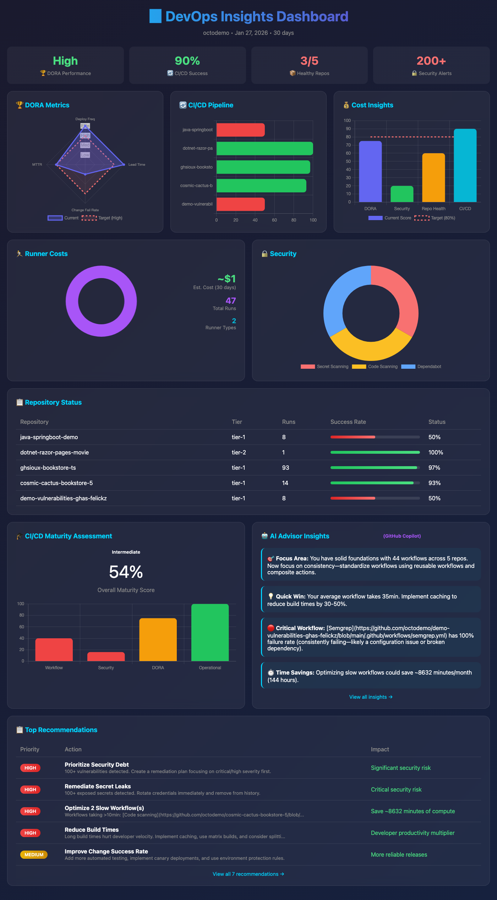

# ActionsPulse 🚀

<div align="center">

[](https://github.com/tsviz/actions-pulse/actions/workflows/build-and-publish.yml)
[](https://github.com/tsviz/actions-pulse/pkgs/container/actions-pulse)
[](https://opensource.org/licenses/MIT)

**Real-time GitHub Actions observability through VS Code with GitHub Copilot**

*DORA Metrics • Cost Analysis • CI/CD Health • Security Compliance*



</div>

---

## ✨ What is ActionsPulse?

ActionsPulse is an **Agentic MCP Server** that brings DevOps observability directly into your IDE. Ask GitHub Copilot questions like:

> 💬 *"Show me our DORA metrics for the last 30 days"*  
> 💬 *"Which workflows are costing us the most?"*  
> 💬 *"Generate a compliance report for SOC2"*  
> 💬 *"What's our deployment frequency this month?"*

And get **interactive visual dashboards** with actionable insights.

## 🎯 Features

| Feature | Organization | Enterprise |
|---------|:------------:|:----------:|
| 📊 **DORA Metrics** | ✅ | ✅ Enhanced |
| ⚡ **Performance Analytics** | ✅ | ✅ |
| 💰 **Cost Optimization** | ✅ | ✅ Cross-org |
| 🏃 **Runner Utilization** | ✅ Self-hosted | ✅ All runners |
| 👥 **Team Productivity** | ✅ | ✅ |
| 🔒 **Compliance Reports** | ✅ (GHAS) | ✅ |
| 💾 **Cache Analytics** | ✅ | ✅ |
| 🎓 **Maturity Assessment** | ✅ | ✅ |

---

## 🚀 Quick Start

### Prerequisites
- ✅ Docker installed
- ✅ GitHub Personal Access Token (fine-grained recommended)
- ✅ VS Code with GitHub Copilot

### 1. Create a Fine-Grained Personal Access Token

1. Go to [GitHub Settings → Developer Settings → Personal Access Tokens → Fine-grained tokens](https://github.com/settings/tokens?type=beta)
2. Click **Generate new token**
3. Configure basic settings:
   - **Token name**: `actions-pulse-mcp`
   - **Expiration**: 90 days (or per your security policy)
   - **Resource owner**: Select your organization
   - **Repository access**: **All repositories**

4. Set **Repository permissions**:

   | Permission | Access | Required | Purpose |
   |------------|--------|----------|---------|
   | Actions | Read | ✅ Yes | Workflow runs, cache usage |
   | Administration | Read | ✅ Yes | Billing data, repo settings |
   | Contents | Read | ✅ Yes | Read config files from devops-config repo |
   | Custom properties | Read | ✅ Yes | Read custom property values on repositories |
   | Deployments | Read | ✅ Yes | Deployment frequency, environments (DORA) |
   | Discussions | Read | 🔶 Optional | Community engagement metrics |
   | Environments | Read | ✅ Yes | Environment protection rules |
   | Issues | Read | ✅ Yes | Issue metrics, resolution times (DORA) |
   | Merge queues | Read | 🔶 Optional | Merge queue adoption and wait times |
   | Metadata | Read | ✅ Yes | Basic repo info (auto-granted) |
   | Pull requests | Read | ✅ Yes | PR metrics, lead time, review times (DORA) |

5. Set **Organization permissions**:

   | Permission | Access | Required | Purpose |
   |------------|--------|----------|----------|
   | Custom properties | Read | ✅ Yes | Read property definitions/schemas at org level |
   | Custom properties for organizations | Read | ✅ Yes | Read property values assigned to repositories |

6. Set **Organization permissions** (continued):

   | Permission | Access | Required | Purpose |
   |------------|--------|----------|---------|
   | Members | Read | 🔶 Optional | Team membership for productivity metrics |
   | Self-hosted runners | Read | 🔶 Optional | Runner utilization metrics |
   | Administration | Read | ✅ Yes | Org billing and settings |

7. **Optional permissions** (for compliance features, requires GitHub Advanced Security):

   | Permission | Access | Required | Purpose |
   |------------|--------|----------|---------|
   | Secret scanning alerts | Read | ❌ Optional | Compliance audit reports |
   | Code scanning alerts | Read | ❌ Optional | Compliance audit reports |

8. Click **Generate token** and save it securely

### 2. Configure MCP Server

#### Option A: Using env-file (Recommended)

Add to your `~/.mcp.env`:
```bash
GITHUB_TOKEN=ghp_your_fine_grained_token_here
```

<details>
<summary>📄 mcp.json with env-file</summary>

Add to VS Code's MCP settings (`~/.vscode/mcp.json` or workspace `.vscode/mcp.json`):
```jsonc
{
  "servers": {
    "actions-pulse": {
      "command": "docker",
      "args": [
        "run", "-i", "--rm",
        "--env-file", "/path/to/.mcp.env",
        "-e", "GITHUB_ORG=your-org-name",
        "ghcr.io/tsviz/actions-pulse:latest"
      ],
      "type": "stdio"
    }
  }
}
```

</details>

#### Option B: Direct Environment Variables

<details>
<summary>📄 mcp.json with inline env vars</summary>

```jsonc
{
  "servers": {
    "actions-pulse": {
      "command": "docker",
      "args": [
        "run", "-i", "--rm",
        "-e", "GITHUB_TOKEN=ghp_your_token",
        "-e", "GITHUB_ORG=your-org-name",
        "ghcr.io/tsviz/actions-pulse:latest"
      ],
      "type": "stdio"
    }
  }
}
```

</details>

### 3. Environment Variables Reference

| Variable | Required | Description |
|----------|----------|-------------|
| `GITHUB_TOKEN` | ✅ Yes | Personal Access Token (fine-grained recommended) |
| `GITHUB_ORG` | ✅ Yes | Target GitHub organization to monitor (e.g., `my-company`). All API calls use this org. |
| `GITHUB_API_URL` | ❌ No | Custom API URL (default: `https://api.github.com`) |
| `GITHUB_ENTERPRISE_SLUG` | ❌ No | Enterprise slug for enhanced features |
| `GITHUB_ENTERPRISE_URL` | ❌ No | GitHub Enterprise Server API URL |
| `DEVOPS_CONFIG_REPO` | ❌ No | Config repo name (default: `devops-config`) |
| `DEVOPS_CONFIG_PATH` | ❌ No | Local path to config files (for mounted configs) |

### 4. Configuration Files (Optional)

You can configure which repositories to monitor and define policies using configuration files. There are two approaches:

#### Option A: Remote Config Repository (Recommended for Teams)

Create a `devops-config` repository in your organization with the following structure:

```
devops-config/
├── devops-config.yaml          # Main configuration
├── repositories/
│   └── inventory.yaml          # List of repos to monitor
├── policies/
│   ├── workflow-policies.yaml  # CI/CD standards
│   └── security-policies.yaml  # Security requirements
└── dashboards/                 # Dashboard configs
```

The MCP server will automatically discover and load from `{org}/devops-config` repo.

#### Option B: Local Config Files (For Development/Testing)

Mount a local config directory into the Docker container:

<details>
<summary>📄 mcp.json with config volume</summary>

```jsonc
{
  "servers": {
    "actions-pulse": {
      "command": "docker",
      "args": [
        "run", "-i", "--rm",
        "--env-file", "/path/to/.mcp.env",
        "-e", "GITHUB_ORG=your-org-name",
        "-e", "DEVOPS_CONFIG_PATH=/app/config",
        "-v", "/path/to/your/config:/app/config:ro",
        "ghcr.io/tsviz/actions-pulse:latest"
      ],
      "type": "stdio"
    }
  }
}
```

</details>

#### Repository Inventory Example

<details>
<summary>📄 inventory.yaml</summary>

Create `repositories/inventory.yaml` to define which repos to monitor:

```yaml
apiVersion: actions-pulse/v1
kind: RepositoryInventory
metadata:
  name: my-inventory
  version: "1.0.0"
  description: "Repositories to monitor"

spec:
  discovery:
    enabled: false  # Only monitor explicit repos

  repositories:
    - name: my-app
      team: platform
      tier: tier-1
      compliance: [SOC2]
      tags: [java, production]

    - name: my-api
      team: backend
      tier: tier-2
      tags: [nodejs, staging]
```

</details>

#### Repository Tiers Quick Reference

| Tier | Priority | Uptime | Response Time | Use Case |
|------|----------|--------|---------------|----------|
| **tier-1** | 🔴 Critical | 99.9% | < 15 min | Production, customer-facing |
| **tier-2** | 🟡 Standard | 99% | < 1 hour | Internal tools, staging |
| **tier-3** | 🟢 Low | Best effort | < 24 hours | Demos, prototypes |

See [docs/ARCHITECTURE.md](docs/ARCHITECTURE.md) for complete tier definitions, compliance requirements, and alerting behavior.

### 5. Restart VS Code

After updating `mcp.json`, restart VS Code to pick up the new MCP server. You can verify the server is running by opening GitHub Copilot Chat and asking about your DevOps metrics.

## 🛠️ Available Tools

<details>
<summary>📊 Usage & Performance Metrics</summary>

### get_actions_usage_metrics
Analyze GitHub Actions usage and billing data (basic).
```
Parameters:
- org_name: Organization name (optional if GITHUB_ORG is set)
- timeframe: '24h' | '7d' | '30d'
- breakdown: 'repository' | 'workflow' | 'runner_type'
```

### get_detailed_usage_metrics ⭐
**GitHub Insights-style** detailed usage metrics with per-workflow, per-job, per-repo, per-OS, and per-runner breakdowns.
```
Parameters:
- org_name: Organization name (optional if GITHUB_ORG is set)
- timeframe: '7d' | '30d' | '90d'
- repo_filter: Comma-separated list of repositories (optional)
```

### get_detailed_performance_metrics ⭐
**GitHub Insights-style** performance metrics with avg run time, queue time, and failure rates per workflow/job/repo/OS/runner.
```
Parameters:
- org_name: Organization name (optional if GITHUB_ORG is set)
- timeframe: '7d' | '30d' | '90d'
- repo_filter: Comma-separated list of repositories (optional)
```

### get_actions_performance_metrics
Get workflow performance analytics with P95/P99 latencies (basic).
```
Parameters:
- org_name: Organization name (optional if GITHUB_ORG is set)
- repo_name: Specific repository (optional)
- workflow_id: Specific workflow (optional)
- timeframe: '1h' | '6h' | '24h' | '7d'
```

</details>

<details>
<summary>🏃 Runners & Cost Optimization</summary>

> **Enhanced Cost Detection**: Reports now use a three-tier system for accurate runner cost calculation:
> - 🎯 **API Detection** - Uses hosted runners API for exact machine specs
> - 🏷️ **Label Detection** - Pattern matching against runner catalog
> - 📊 **Default Pricing** - OS-based fallback
>
> See [Configuration Guide](docs/CONFIGURATION.md#enhanced-runner-cost-detection) for details.

### analyze_runner_utilization
Analyze runner utilization and efficiency.
```
Parameters:
- org_name: Organization name (optional if GITHUB_ORG is set)
- runner_type: 'self-hosted' | 'github-hosted' | 'all'
- include_costs: Include cost analysis (default: true)
```

### get_actions_cache_analytics
Analyze Actions cache usage and efficiency.
```
Parameters:
- org_name: Organization name (optional if GITHUB_ORG is set)
- repo_name: Specific repository (optional)
- timeframe: '24h' | '7d' | '30d'
```

### generate_cost_optimization_report
Generate actionable cost optimization recommendations.
```
Parameters:
- org_name: Organization name (optional if GITHUB_ORG is set)
- include_recommendations: Include actionable recommendations (default: true)
- target_savings_percentage: Target savings (5-50, default: 20)
```

</details>

<details>
<summary>🔍 Workflow Insights & Team Productivity</summary>

### get_workflow_insights
Get workflow insights with bottleneck detection.
```
Parameters:
- org_name: Organization name (optional if GITHUB_ORG is set)
- repo_name: Repository name (required)
- workflow_name: Workflow name or filename (required)
- analyze_dependencies: Analyze job dependencies (default: true)
```

### get_team_productivity_metrics
Analyze team productivity based on Actions and commit data.
```
Parameters:
- org_name: Organization name (optional if GITHUB_ORG is set)
- team_slug: Team slug (optional)
- include_individuals: Include individual metrics (default: false)
- timeframe: '7d' | '30d' | '90d'
```

### get_compliance_audit_report
Generate compliance and security audit report.
```
Parameters:
- org_name: Organization name (optional if GITHUB_ORG is set)
- compliance_framework: 'SOC2' | 'ISO27001' | 'HIPAA' | 'PCI-DSS' | 'CUSTOM'
- include_secrets_scan: Include secret scanning (default: true, requires GHAS)
```

</details>

---

## 📊 DORA Metrics & Developer Experience

<details>
<summary>📈 DORA Metrics</summary>

### get_dora_metrics
Get DORA metrics (Deployment Frequency, Lead Time, Change Failure Rate, Time to Restore).
```
Parameters:
- org_name: Organization name (optional if GITHUB_ORG is set)
- timeframe: '7d' | '30d' | '90d'
- repo_filter: Comma-separated list of repositories (optional)
```

### get_enhanced_dora_metrics
DORA metrics using actual GitHub Deployments API for maximum accuracy.
```
Parameters:
- org_name: Organization name (optional if GITHUB_ORG is set)
- timeframe: '7d' | '30d' | '90d'
- repo_filter: Comma-separated list of repositories (optional)
```

### get_pull_request_metrics
Pull request metrics including lead time, merge rates, and size distribution.
```
Parameters:
- org_name: Organization name (optional if GITHUB_ORG is set)
- timeframe: '7d' | '30d' | '90d'
- repo_name: Specific repository (optional)
- include_stale: Include stale PR analysis (optional)
```

### get_issue_metrics
Issue metrics including time to close, label distribution, and backlog health.
```
Parameters:
- org_name: Organization name (optional if GITHUB_ORG is set)
- timeframe: '7d' | '30d' | '90d'
- repo_name: Specific repository (optional)
- label_filter: Filter by label (optional)
```

### get_deployment_metrics
Deployment metrics from GitHub Deployments API.
```
Parameters:
- org_name: Organization name (optional if GITHUB_ORG is set)
- timeframe: '7d' | '30d' | '90d'
- environment: Filter by environment (optional)
- repo_filter: Comma-separated list of repositories (optional)
```

### get_environment_metrics
Analyze GitHub environment configurations including protection rules.
```
Parameters:
- org_name: Organization name (optional if GITHUB_ORG is set)
- repo_filter: Comma-separated list of repositories (optional)
```

### get_discussion_metrics
GitHub Discussions metrics including answer rates and engagement.
```
Parameters:
- org_name: Organization name (optional if GITHUB_ORG is set)
- repo_name: Specific repository (optional)
- timeframe: '7d' | '30d' | '90d'
```

### get_merge_queue_metrics
Merge queue usage and adoption across repositories.
```
Parameters:
- org_name: Organization name (optional if GITHUB_ORG is set)
- repo_name: Specific repository (optional)
```

</details>

---

## 🏷️ Custom Properties

<details>
<summary>📋 Custom Properties Tools</summary>

### get_org_custom_properties
List all custom property definitions for an organization.
```
Parameters:
- org_name: Organization name (optional if GITHUB_ORG is set)
```

### get_custom_properties_analytics
Analyze custom property usage and coverage across repositories.
```
Parameters:
- org_name: Organization name (optional if GITHUB_ORG is set)
```

### get_repos_by_property
Find repositories by custom property value.
```
Parameters:
- org_name: Organization name (optional if GITHUB_ORG is set)
- property_name: Custom property name (e.g., team, tier, compliance)
- property_value: Property value to filter by (optional)
```

</details>

---

## 🏢 Enterprise Features (Optional)

<details>
<summary>⚙️ Enterprise configuration</summary>

If you have GitHub Enterprise, you can enable enhanced features by adding:

```bash
GITHUB_ENTERPRISE_SLUG=your-enterprise-slug
```

This enables:
- Cross-organization billing aggregation
- Enterprise-wide runner pools
- Consolidated audit logs

</details>

## 🔧 Development

<details>
<summary>🛠️ Build and run commands</summary>

### Build locally
```bash
npm install
npm run build
docker build -t actions-pulse:local .
```

### Run locally (without Docker)
```bash
export GITHUB_TOKEN=ghp_your_token
export GITHUB_ORG=your-org
npm start
```

</details>

## 📚 Documentation

| Document | Description |
|----------|-------------|
| [Quick Start](docs/QUICKSTART.md) | Get up and running in 5 minutes |
| [Configuration Guide](docs/CONFIGURATION.md) | Complete configuration reference |
| [Architecture](docs/ARCHITECTURE.md) | System design and tier definitions |

### Example Configurations

Ready-to-use configuration examples are available in the [examples/](examples/) directory:

| File | Description |
|------|-------------|
| [mcp-docker.json](examples/mcp-docker.json) | VS Code MCP config using Docker |
| [mcp-local.json](examples/mcp-local.json) | VS Code MCP config for local development |
| [mcp-envfile.json](examples/mcp-envfile.json) | VS Code MCP config using environment file |
| [.env.example](examples/.env.example) | Environment variables template |
| [inventory.yaml](examples/inventory.yaml) | Repository inventory example |
| [devops-config.yaml](examples/devops-config.yaml) | DevOps observer configuration |
| [docker-compose.yml](examples/docker-compose.yml) | Docker Compose deployment |

## �📄 License

MIT